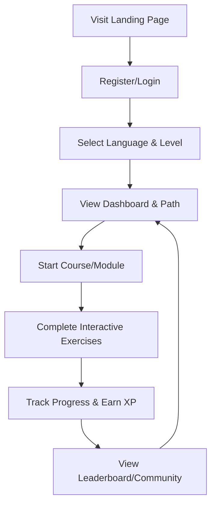

## 1. Product Overview
An online language education platform supporting multiple mainstream languages (English, Japanese, Korean, etc.).
- Delivers an immersive language learning experience with leveled courses, interactive modules, and community features.
- Aims to help users achieve fluency through personalized paths, progress tracking, and achievement incentives.

## 2. Core Features

### 2.1 User Roles
| Role | Registration Method | Core Permissions |
|------|---------------------|------------------|
| Learner | Email/Social login | Browse courses, track progress, participate in community, use interactive modules |

### 2.2 Feature Module
1. **Home/Landing Page**: Hero section, language selection, course highlights, user testimonials.
2. **Dashboard**: Learning progress tracking, personalized path recommendations, daily goals.
3. **Course Hub**: Leveled course system, category filters (vocabulary, grammar, listening, oral).
4. **Interactive Modules**: Vocabulary memorization (flashcards), grammar exercises, oral shadowing (voice recording), listening training.
5. **Community**: Forums, leaderboards, achievement badges, peer interactions.
6. **Auth**: Registration, login, profile management.

### 2.3 Page Details
| Page Name | Module Name | Feature description |
|-----------|-------------|---------------------|
| Landing Page | Hero Section | Catchy slogan, language selection dropdown, call-to-action to sign up |
| Dashboard | Progress Tracker | Visual charts of study time, mastered words, course completion rate |
| Dashboard | Path Recommendations | AI-driven suggested next steps based on user's level and goals |
| Course Player | Interactive Exercises | Flashcards, fill-in-the-blanks, audio playback, microphone recording for shadowing |
| Community | Leaderboard | Ranks users by weekly XP, displays achievement badges |
| Auth | Login/Register Form | Secure authentication flow |

## 3. Core Process
1. User visits the landing page and signs up.
2. User selects a target language and takes a placement test (or selects a level).
3. System generates a personalized learning path.
4. User engages in daily interactive modules (vocab, grammar, listening, oral).
5. Progress is tracked and achievements are unlocked.
6. User interacts with the community to share progress and compete on leaderboards.

## 4. User Interface Design
### 4.1 Design Style
- **Primary and secondary colors**: Vibrant Indigo (Primary) for focus, Soft Mint Green (Secondary) for success/progress, clean White background.
- **Button style**: Rounded corners (pill shape), subtle drop shadows, smooth hover animations.
- **Font and sizes**: Plus Jakarta Sans for headings (bold, modern), Inter for body text (highly readable).
- **Layout style**: Card-based UI with ample whitespace, sticky top navigation, sidebar for dashboard.
- **Icon/emoji style suggestions**: Flat, colorful vector icons (e.g., Lucide icons), playful emojis for achievements.

### 4.2 Page Design Overview
| Page Name | Module Name | UI Elements |
|-----------|-------------|-------------|
| Dashboard | Progress Tracker | Circular progress rings, bar charts, card layout, smooth transitions |
| Course Player | Interactive Modules | Large flashcards, clear audio playback buttons, waveform visualizer for oral shadowing |
| Community | Leaderboard | List layout, user avatars, gold/silver/bronze badge icons |

### 4.3 Responsiveness
Desktop-first design, fluid grid system for tablet adaptation, bottom navigation bar for mobile touch optimization.
