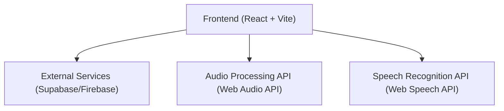
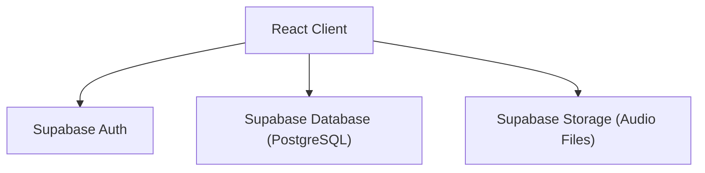
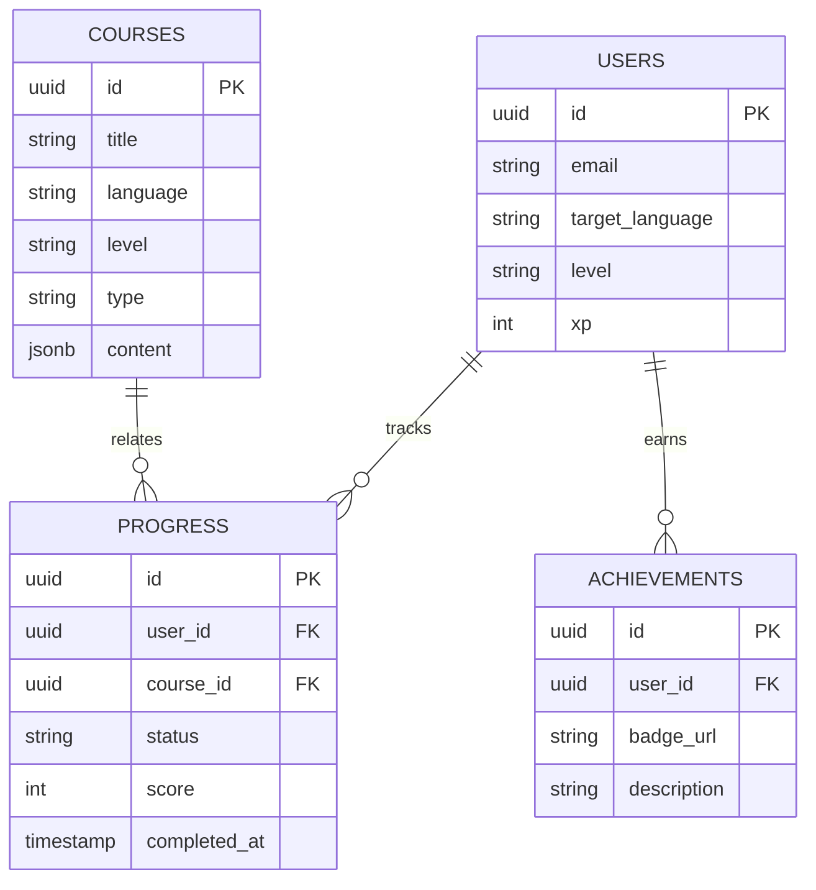

## 1. Architecture Design



## 2. Technology Description
- **Frontend**: React@18 + tailwindcss@3 + vite
- **UI Library**: shadcn/ui, lucide-react (icons), framer-motion (animations)
- **State Management**: Zustand
- **Routing**: React Router
- **Data Fetching/Auth**: Supabase (Backend-as-a-Service for Auth, Database, Storage)
- **Audio Processing**: Web Audio API (for recording and analyzing oral shadowing)
- **Initialization Tool**: vite-init

## 3. Route Definitions
| Route | Purpose |
|-------|---------|
| `/` | Landing page (marketing, language selection) |
| `/login` | User login and registration |
| `/dashboard` | User learning progress, path recommendations |
| `/courses` | Leveled course catalog |
| `/courses/:id` | Specific interactive course module (vocab, grammar, listening, oral) |
| `/community` | Leaderboards, forums, achievements |
| `/profile` | User profile, settings, language preferences |

## 4. API Definitions
*Note: Using a BaaS (Supabase) so most APIs are client SDK calls. Types defined below for state.*
```typescript
interface User {
  id: string;
  email: string;
  targetLanguage: string;
  level: string;
  xp: number;
}

interface Course {
  id: string;
  title: string;
  language: string;
  level: string;
  type: 'vocabulary' | 'grammar' | 'listening' | 'oral';
  content: any; // Flashcards, quizzes, audio URLs
}

interface Progress {
  userId: string;
  courseId: string;
  status: 'started' | 'completed';
  score: number;
  completedAt: string;
}

interface Achievement {
  id: string;
  userId: string;
  badgeUrl: string;
  description: string;
}
```

## 5. Server Architecture Diagram
*Note: Utilizing BaaS (Supabase), so backend architecture is simplified to database and edge functions.*



## 6. Data Model

### 6.1 Data Model Definition



### 6.2 Data Definition Language
*Note: Example DDL for Supabase PostgreSQL.*
```sql
CREATE TABLE users (
  id UUID PRIMARY KEY DEFAULT uuid_generate_v4(),
  email TEXT UNIQUE NOT NULL,
  target_language TEXT NOT NULL,
  level TEXT NOT NULL,
  xp INTEGER DEFAULT 0
);

CREATE TABLE courses (
  id UUID PRIMARY KEY DEFAULT uuid_generate_v4(),
  title TEXT NOT NULL,
  language TEXT NOT NULL,
  level TEXT NOT NULL,
  type TEXT NOT NULL,
  content JSONB NOT NULL
);

CREATE TABLE progress (
  id UUID PRIMARY KEY DEFAULT uuid_generate_v4(),
  user_id UUID REFERENCES users(id),
  course_id UUID REFERENCES courses(id),
  status TEXT NOT NULL,
  score INTEGER DEFAULT 0,
  completed_at TIMESTAMP WITH TIME ZONE DEFAULT NOW()
);

CREATE TABLE achievements (
  id UUID PRIMARY KEY DEFAULT uuid_generate_v4(),
  user_id UUID REFERENCES users(id),
  badge_url TEXT NOT NULL,
  description TEXT NOT NULL
);
```
